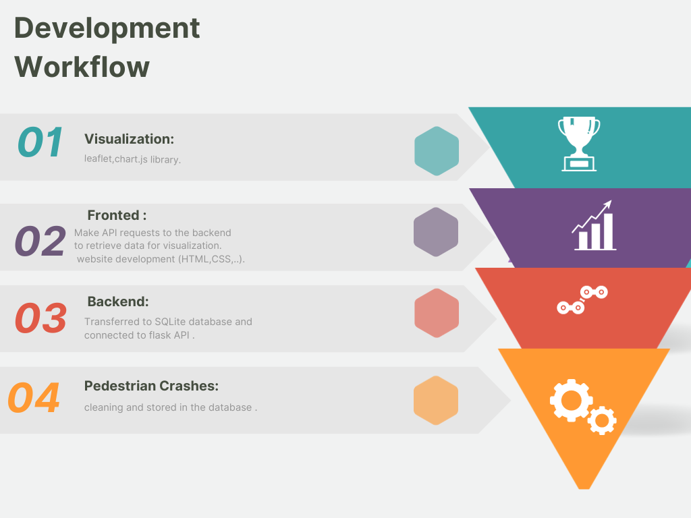

# Analyzing-Pedestrian-Accidents-
## Project Overview and Purpose

This  Analyzing-Pedestrian-Accidents compiles and analyzes data related to Pedestrian Crashes reported since 2012, as documented by the Australian Federal Police (AFP) through the AFP Crash Report Form. The primary purpose of this project is to provide insights into pedestrian safety and accident patterns in Australia. It aims to:

- **Analyze Crash Data:** This project collects, cleans, and organizes pedestrian crash data reported by the police or the public. By doing so, it seeks to identify trends, hotspots, and contributing factors to pedestrian accidents.

- **Enhance Safety Measures:** Through data-driven insights, this project strives to contribute to improved pedestrian safety measures. The findings may help authorities and urban planners make informed decisions regarding road infrastructure, signage, and traffic regulations.

- **Raise Awareness:** By making this data accessible to the public and researchers, this project aims to raise awareness about pedestrian safety issues. It encourages discussions and initiatives to reduce pedestrian accidents and improve road safety.
This repository serves as a valuable resource for anyone interested in pedestrian safety, urban planning, or road safety initiatives in Australia. It is a starting point for data-driven analysis and discussions aimed at making our streets safer for pedestrians.
## How to Use and Interact with the Project

This data visualization project aims to tell a compelling story using data visualizations, providing insights into a dataset with over 100 records. Below are the steps to interact with the project effectively:

### Prerequisites

Before getting started, make sure you have the following prerequisites installed:

- [Python](https://www.python.org/downloads/)
- [Flask](https://flask.palletsprojects.com/en/2.1.x/installation/)
- [] 
# Running the Project with Flask-CORS

1. Install Flask-CORS using pip:
   ```bash
   pip install Flask-CORS
- [SQLite]( https://www.sqlite.org/download.html)

### Database Setup

To set up the database for this project, follow these steps:

1. **Database Creation:** Using Python in Jupyter Notebook, run the starter_code note book to create a database and connect to SQLite.
   ```python
   # Example for creating a SQLite database
   import sqlite3

   # Connect to the database or create it if it doesn't exist
   conn = sqlite3.connect('crash_database.db')
### Running the Project

1. Run the Flask application.
3. Open your web browser and navigate to the provided URL (usually `http://127.0.0.1:5000/`).

### Interacting with Visualizations

1. On the project website, you will find interactive visualizations created using JavaScript libraries.

2. Use HTML menus, dropdowns, and textboxes to filter and customize the visualizations based on your preferences. These interactive components will allow you to explore the data and gain insights.

3. Explore different aspects of the dataset, change parameters, and observe how the visualizations respond dynamically.

### API Routes (Optional)

If you wish to access the visualizations via API routes, the Flask application provides interactive API endpoints. You can make requests to these endpoints to retrieve specific visualizations as JSON data.

- Example API routes:
- `[/map](http://127.0.0.1:5000/)`: Retrieves data for Visualization map.
- `[/pie](http://127.0.0.1:5000/)`: Retrieves data for Visualization pie.
- `[/bar](http://127.0.0.1:5000/)`: Retrieves data for Visualization bar.
- `[/dashboard](http://127.0.0.1:5000/)`: Retrieves data for Visualization dashboard.
- `[/api/all-data-json](http://127.0.0.1:5000/)`: Retrieves data as json.

## Development Workflow

Here is a visual representation of our development workflow:



## Ethical Considerations

In accordance with the principles outlined in the privacy policy of Data.gov.au, we are committed to upholding ethical standards throughout our project involving pedestrian crash data. The following considerations guide our ethical approach:

### Data Accuracy and Integrity

We strive to maintain the accuracy and integrity of the data we collect and analyze. We are committed to presenting reliable information that does not mislead or harm individuals or organizations involved in pedestrian crashes.

### Transparency

We maintain transparency by documenting our data sources, collection methods, and data processing procedures. We ensure that users have access to clear and comprehensible information about our project's data handling practices.

### Compliance

We adhere to relevant privacy laws, such as the Privacy Act 1988 (Cth), and adhere to guidelines issued by government authorities, such as the Office of the Australian Information Commissioner.

By adhering to these ethical considerations, we ensure responsible data handling and the protection of individual privacy throughout our project.
## Data Source References

### Pedestrian Crash Data
The pedestrian crash data used in this project is sourced from the Australian Federal Police (AFP) through the AFP Crash Report Form. You can access and explore the data on the [Data.gov.au website](https://www.data.gov.au/dataset/ds-act-https%3A%2F%2Fwww.data.act.gov.au%2Fapi%2Fviews%2Femq2-8bc4/details?q=). Please note that while we strive to provide accurate and up-to-date crash information, the data may have a backlog of entries and may not always reflect real-time crash locations or complete casualty crash reports.

### Code and Visualization Library

We use [Chart.js](https://www.chartjs.org/) for creating interactive and visually appealing data visualizations in this project. Chart.js is a versatile JavaScript library that allows us to display data in various chart types, enhancing the accessibility and understanding of the insights we present.

### HTML Page Design

For designing the HTML pages and enhancing the user interface, we rely on [Bootstrap](https://getbootstrap.com/). Bootstrap is a popular front-end framework that provides a wide range of responsive design components and utilities, helping us create a user-friendly experience.

By utilizing Chart.js for data visualization, Bootstrap for HTML page design, and sourcing our data from Data.gov.au, we aim to provide you with informative and engaging visual representations of the pedestrian crash data, presented within an aesthetically pleasing and user-friendly interface.

Please refer to the respective documentation and licenses of the data source, chart library, and Bootstrap for more details.


